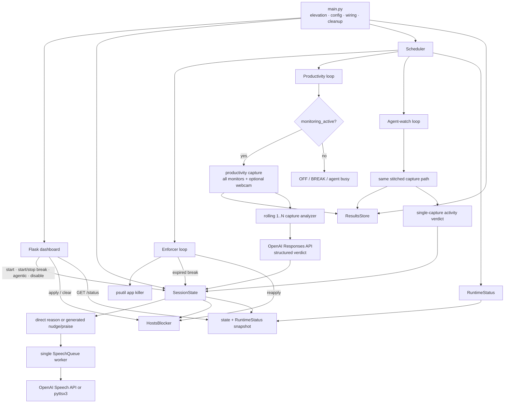

# Deep Work: Windows Productivity Enforcement

Deep Work is a personal Windows 11 focus app. During a focused session it
blocks configured website domains through the Windows hosts file, terminates
named distraction apps, periodically captures every monitor and an optional
webcam frame, asks an OpenAI vision model for a structured productivity
verdict, and speaks feedback. A local Flask dashboard controls the session and
shows current state and scheduler health.

This is an enforcement aid, not a security boundary. The blocklist is explicit,
the AI can be wrong, and anyone with administrator access can undo the policy.

## Implemented behavior

1. **Website blocking**
   - The configured groups are Reddit, YouTube, Twitter/X, Discord, Hacker
     News, LinkedIn, Bluesky, Substack, Facebook, LessWrong, EA Forum, and
     4chan.
   - `deepwork/config.py` expands those groups into explicit hostnames. There
     is no wildcard matching.
   - `HostsBlocker` writes both `127.0.0.1` and `::1` entries inside a
     marker-fenced `# >>> deepwork block start` section, then runs
     [`ipconfig /flushdns`](https://learn.microsoft.com/en-us/windows-server/administration/windows-commands/ipconfig).
   - Starting a session, starting or stopping a break, or changing agent state
     reapplies the effective blocklist. `/disable` and normal interpreter
     shutdown remove the fenced section.

2. **Distraction-app termination**
   - While mode is ON or BREAK, the enforcer checks every
     `KILL_INTERVAL_S` seconds and kills exact, case-insensitive process-name
     matches for Discord, Telegram, and Steam.
   - A break can spare selected app groups. Stopping it restores the normal
     process targets for the next enforcer tick. Task-scoped website access and
     agentic waiting do **not** spare desktop apps.

3. **Rolling progress evaluation**
   - On each active monitor tick, `mss` captures every physical monitor.
     OpenCV contributes one webcam frame when camera capture succeeds; webcam
     failure is non-fatal.
   - The images are stacked into one timestamped, labeled JPEG.
   - Every successful capture immediately triggers one Responses API
     evaluation over the newest one through
     `PROGRESS_WINDOW_CAPTURES` stitched captures, oldest first.
   - With the defaults, the fifth successful tick is the first full
     five-capture window. Five captures sampled five minutes apart span about
     20 minutes from the oldest image to the newest, although that first full
     window completes about 25 minutes after an uninterrupted loop begins.
   - Warm-up prompts forbid declaring a stall merely because fewer than five
     captures exist. A full window can be judged stalled, while the prompt
     explicitly allows plausible reading, thinking, calls, and builds.

4. **Spoken feedback**
   - Starting a session generates and queues an LLM-written good-luck message.
     Starting or manually stopping a break queues a context-grounded
     acknowledgment.
   - Each successful productivity evaluation queues exactly one utterance.
     An ordinary productive verdict speaks the vision model's reason directly.
     An off-track verdict or praise milestone first uses the text model to
     generate a context-grounded nudge or congratulations.
   - At the default cadence, each productive verdict credits five streak
     minutes. Six consecutive productive verdicts trigger praise and reset the
     streak counter. This is configured-interval accounting, not measured
     foreground activity time.
   - OFF, BREAK, and agent-busy states pause new periodic evaluations. They do
     not cancel speech that was already queued.
   - `TTS_ENGINE=openai` uses the Speech API; `TTS_ENGINE=pyttsx3` changes only
     playback to offline Windows speech. Vision and message generation still
     require OpenAI. The dashboard discloses that OpenAI speech is
     AI-generated, as required by the
     [OpenAI TTS guide](https://developers.openai.com/api/docs/guides/text-to-speech).

5. **ON, OFF, and BREAK modes**
   - **ON:** effective website blocking, app termination, and productivity
     monitoring are active.
   - **OFF:** entering this mode through `/disable` clears the hosts section,
     and monitor/app enforcement ticks do no work.
   - **BREAK:** monitoring pauses until the timed break expires or the user
     selects **Stop break and resume work**. Task-required sites remain open,
     and the break can add selected site/app exceptions.
   - A positive social-media break submitted through the provided form reserves
     its requested minutes immediately against the local-date daily allowance
     (120 minutes by default). A positive request beyond the remaining
     allowance is refused. Manually stopping refunds unelapsed reserved minutes
     and charges every started minute, rounded up and capped at the requested
     duration. Natural expiry keeps the full reservation. Away breaks do not
     spend that allowance.
   - Turning enforcement off requires the exact, case-sensitive phrase:
     `I will not stop cool deepwork session`.

6. **Task-scoped website access**
   - The Start form accepts checked site groups and an optional
     `projects.json` preset. Their ordered, deduplicated union stays open for
     that focused session.
   - These sites remain monitored, do not spend social-break minutes, and do
     not exempt desktop apps.
   - Task and preset keys are validated server-side. Starting another session
     resets the one-off choices.

7. **Agentic engineering mode**
   - An optional watcher uses the same stitched monitor/webcam capture path and
     a low-detail vision request every `AGENT_CHECK_INTERVAL_S` seconds.
   - When the latest verdict changes to "agent working," the **website**
     blocklist becomes empty and productivity monitoring pauses. The app killer
     continues.
   - When the watcher later observes an idle, finished, or input-waiting agent,
     normal website restrictions return while task-required sites remain open,
     and one transition message is spoken.
   - Detection occurs on scheduled polls, not instantly, and AI classification
     can be wrong. Agentic waiting does not spend social-break allowance.

8. **Local realtime dashboard**
   - The Flask development server binds only to `127.0.0.1` and defaults to
     port `5000` through `UI_PORT`.
   - The browser requests the no-cache `/status` JSON endpoint every three
     seconds, never overlaps polls, pauses polling in a hidden tab, and keeps
     the last good view during a temporary connection failure.
   - It displays session state, task access, break and agent state, configured
     effective enforcement counts, current-session verdict history, and the
     cadence/result/error state of all scheduler loops.

9. **Local artifacts and logs**
   - `results/captures/*.jpg`: stitched productivity and agent-watch captures.
   - `results/llm/*.json`: full successful model response objects and complete
     textual prompts. Image request payloads refer to the separately stored
     JPEG paths instead of duplicating base64 data.
   - `results/sessions/*.jsonl`: timestamped session events.
   - `results/state.json`: daily social usage and previous topics only.
   - `logs/deepwork_*.log`: timestamped runtime logs, also streamed to the
     terminal.

## Architecture

`main.py` is the orchestration wrapper. It performs elevation, configuration
and logging, blocker selection, object wiring, cleanup registration, and run
mode selection. Domain behavior is in `deepwork/`.



The scheduler uses fixed-delay loops: each loop waits its configured interval,
runs the blocking tick, then waits again. Capture/API duration therefore adds
to the wall-clock time between tick starts, and session Start does not reset
the global loop countdown.

## Requirements

- Windows 11. Hosts-file editing, UAC elevation, DirectShow camera capture, and
  `winsound` playback are Windows-specific.
- [uv](https://docs.astral.sh/uv/) and internet access. `.python-version`
  selects Python 3.13; uv creates the project-local `.venv`.
- An OpenAI API key with access to the configured text/image and speech
  models.
- Administrator approval for real hosts-file enforcement.
- A camera and audio output are optional; missing webcam input is tolerated,
  while speech failures are logged.

## Install

```powershell
git clone https://github.com/BurnyCoder/jarvis-waifu-supervisor.git deep-work
cd deep-work
uv sync --locked
Copy-Item .env.example .env
# Edit .env and replace the placeholder OPENAI_API_KEY.
```

`uv sync --locked` reproduces the checked-in lockfile in `./.venv`; use plain
`uv sync` after intentionally changing dependencies. See the
[uv project guide](https://docs.astral.sh/uv/guides/projects/) for the
environment and lockfile behavior.

### Configuration

`.env` contains the runtime tunables:

| Variable | Default | Purpose |
|---|---:|---|
| `OPENAI_API_KEY` | none | Required API credential |
| `VISION_MODEL` | `gpt-5.6-sol` | Rolling productivity vision model |
| `PROGRESS_REASONING_EFFORT` | `xhigh` | Productivity-model reasoning effort |
| `AGENT_VISION_MODEL` | `gpt-5.4-mini` | Frequent agent-activity vision model |
| `TEXT_MODEL` | `gpt-5.4-mini` | Good-luck/nudge/praise message model |
| `TTS_ENGINE` | `openai` | `openai` or `pyttsx3` playback |
| `TTS_MODEL` | `gpt-4o-mini-tts` | OpenAI speech model |
| `TTS_VOICE` | `coral` | OpenAI speech voice |
| `CAPTURE_INTERVAL_S` | `300` | Fixed delay before each productivity tick |
| `PROGRESS_WINDOW_CAPTURES` | `5` | Maximum rolling capture count |
| `KILL_INTERVAL_S` | `3` | Fixed delay before each enforcement tick |
| `AGENT_CHECK_INTERVAL_S` | `60` | Fixed delay before each agent-watch tick |
| `DAILY_SOCIAL_CAP_MIN` | `120` | Daily social-break reservation cap |
| `UI_PORT` | `5000` | Loopback dashboard port |

`BATCH_SIZE` remains a compatibility fallback for
`PROGRESS_WINDOW_CAPTURES`. The hosts path, website/app tables, and disable
phrase are code constants rather than `.env` settings.

The current model IDs are documented by OpenAI:
[GPT-5.6 Sol](https://developers.openai.com/api/docs/models/gpt-5.6-sol),
[GPT-5.4 mini](https://developers.openai.com/api/docs/models/gpt-5.4-mini),
and
[GPT-4o mini TTS](https://developers.openai.com/api/docs/models/gpt-4o-mini-tts).
Model access and lifecycle can vary, so change the `.env` values and retest if
your API project cannot use a default.

## Run

### Terminal (recommended)

```powershell
uv run pytest                      # hardware/network/admin-free unit suite
uv run python main.py --smoke      # one real capture -> vision -> speech tick
uv run python main.py --dry-hosts  # full UI; hosts changes are logged only
uv run python main.py              # real UAC + hosts enforcement + local UI
```

`--smoke` uses real screen/webcam capture and the configured OpenAI models. It
stores and uploads the capture just like a normal productivity tick. It skips
administrator elevation and uses the dry-run hosts blocker.

`--dry-hosts` is dry only for hosts-file writes. After a session starts it can
still terminate configured apps, capture and upload monitor/webcam images,
call the configured models, store artifacts, and play speech.

For a normal run:

1. Accept the UAC prompt.
2. Read the logged `control panel:` URL and open
   `http://127.0.0.1:<UI_PORT>`.
3. Enter a topic, choose only task-required sites, optionally enable agentic
   mode, and select **Start session**.
4. Start a timed break when needed. While it is active, use **Stop break and
   resume work** to end it early; the stop action needs no confirmation.
5. Use Ctrl+C for a normal shutdown so the registered cleanup can clear the
   hosts section. Do not assume that closing or killing the console will run
   cleanup.

The server is Flask's development server and is intentionally loopback-only.
Do not expose it to a network without adding production serving, authentication,
and request protections; Flask explicitly says its
[development server is not for production](https://flask.palletsprojects.com/server/).

### Double-click launcher

`Start Deep Work.bat` self-elevates, checks that `uv` is on `PATH`, and runs
`uv run python main.py`. Its browser helper is currently hardcoded to
`http://127.0.0.1:5599`, while the application and `.env.example` default to
port `5000`. Set `UI_PORT=5599`, update the URL in the batch file, or open the
actual logged URL manually.

During the 2026-07-20 audit, `wslrelay` was also observed occupying port
`5000` on the development workstation; choosing another `UI_PORT` is the
appropriate remedy when that conflict is present.

## Dashboard and `/status`

Productivity history is scoped to the current in-memory session:

- Every completed evaluation appears newest-first with its timestamp,
  productive/off-track label, complete reason, and expandable observation.
- BREAK and OFF preserve the last session's timeline for review.
- Starting another session clears the timeline and latest verdict.
- Restarting the Python process clears dashboard verdict history; durable
  verdict events remain in `results/sessions/*.jsonl`.

Inspect the JSON endpoint directly:

```powershell
$port = 5000  # replace with UI_PORT
Invoke-RestMethod "http://127.0.0.1:$port/status"
```

The dashboard renders LLM text with `textContent` and does not expose saved
capture images or raw prompt files through an HTTP route.

## Task-required sites and presets

Create an optional `projects.json` beside `main.py`:

```json
{
  "ml-research": ["twitter", "linkedin"],
  "community": ["discord", "bluesky"]
}
```

Valid keys are:

```text
reddit youtube twitter discord hackernews linkedin
bluesky substack facebook lesswrong eaforum 4chan
```

A preset is unioned with one-off Start-form selections. Invalid JSON, an
invalid shape, an unknown preset, or an unknown task/preset site key fails
before the session can weaken enforcement. One-off task access is intentionally
excluded from `results/state.json`.

Break exceptions use comma-separated group keys in the dashboard. The current
break route relies on browser-side duration/type constraints and does not
perform the strict task/preset validation. A forged request can therefore
submit an invalid duration or kind; unknown break keys have no effect rather
than producing an error. Use a positive duration, kind `away` or
`social_media`, the site keys above, and app keys `discord`, `telegram`, and
`steam`. `POST /break/stop` has no form fields and is safe to repeat after the
break has already ended. A manual social-break stop bills elapsed started
minutes and records requested, elapsed, charged, and refunded values in the
session JSONL event.

## Data, privacy, and cost

- Every productivity and agent-watch vision request uploads the stitched
  monitor image and optional webcam frame to OpenAI as image input. Topics,
  allowed-site context, observations, and feedback prompts are also sent.
- `TTS_ENGINE=pyttsx3` keeps audio synthesis local but does **not** make the
  rest of the application offline.
- Captures, logs, exchange JSON, and state are ordinary unencrypted local
  files. They may contain sensitive screen, webcam, topic, and model-output
  data. Protect the Windows account and delete old artifacts deliberately.
- `.env`, `logs/`, and `results/` are gitignored. Never force-add them.
- The app does not calculate spend. A normal successful productivity tick uses
  one multi-image vision request and one speech request; nudges and praise add
  a text-generation request. Agentic mode adds polling vision requests and
  transition message/speech requests.
- OpenAI meters each image as input tokens, and tokenization depends on model,
  dimensions, and detail. Use the current
  [vision guide](https://developers.openai.com/api/docs/guides/images-vision)
  and [pricing page](https://developers.openai.com/api/docs/pricing) instead
  of relying on a fixed per-day estimate.

## Verification

### Automated

```powershell
uv run pytest
uv run python main.py --help
```

The unit suite uses fakes and temporary paths; it does not require
administrator access, an API call, capture hardware, or audio playback.

### Manual end-to-end checklist

1. Start `uv run python main.py`, accept UAC, and open the logged dashboard URL.
2. Start a session allowing `twitter` and `linkedin`.
3. Inspect `C:\Windows\System32\drivers\etc\hosts`: the fenced section should
   omit the selected groups, include an unselected domain such as `reddit.com`,
   and contain both IPv4 and IPv6 loopback entries.
4. Confirm an unselected hostname resolves to `127.0.0.1` or `::1`, then test
   the actual browser because browser-level resolution and caches can differ.
5. Launch Discord or Steam; an exact configured process should be terminated
   on an enforcement tick.
6. Start a ten-minute social break allowing `reddit`; confirm the full
   reservation is deducted immediately and monitoring pauses. Stop it after a
   few seconds; confirm one minute remains charged, the other nine are
   refunded, `reddit` is re-blocked, monitoring resumes, and a return-to-work
   message is spoken. Also let a later one-minute break expire and confirm its
   full reservation remains charged.
7. Submit a wrong disable phrase and confirm HTTP 403/state remains ON; submit
   the exact phrase and confirm the fenced hosts section is removed.
8. Run `uv run python main.py --smoke` and inspect the newest files under
   `logs/`, `results/captures/`, `results/llm/`, and `results/sessions/`.
9. Verify that the stored prompt describes the selected task sites
   conditionally, the model output matches the prompt contract, and the spoken
   line matches the recorded verdict.

## Known limitations

- **Explicit hosts only:** hosts files do not support wildcard domain policy.
  Unlisted subdomains, alternate domains, direct IP access, proxies, VPNs, or
  application-specific resolvers can bypass or partially defeat blocking.
  For Substack, this project covers `substack.com` and `www.substack.com`, not
  arbitrary author subdomains.
- **DoH behavior varies by resolver:** Microsoft's
  [Windows resolver documentation](https://learn.microsoft.com/en-us/troubleshoot/windows-client/networking/troubleshoot-dns-client-resolution-issues)
  says the DNS client checks its cache and hosts file before querying DNS, but
  software that uses its own resolver can bypass the Windows path. Mozilla
  documents that
  [Firefox DoH can bypass local DNS filtering](https://support.mozilla.org/en-US/kb/firefox-dns-over-https).
  If a blocked site still resolves, inspect that browser's secure-DNS mode and
  cache rather than assuming every browser behaves alike.
- **Process names are finite:** renamed executables, web versions, helper
  processes not listed in `APP_PROCESSES`, and protected processes are outside
  the current app-killer policy.
- **Low-detail vision is fallible:** the analyzer intentionally sends
  `detail="low"`, which OpenAI describes as a low-resolution mode. Small text,
  wide stitched images, occlusion, and ambiguous activity can produce an
  incorrect verdict.
- **Fixed-delay timing:** API and capture latency extend the real interval.
  Agent completion can remain undetected until a later watcher tick.
- **Break validation is incomplete:** HTML constrains normal form input, but
  `/break` does not validate the duration range, kind, or exception keys
  server-side. In particular, a forged negative social duration can corrupt
  allowance accounting. Keep the panel loopback-only and treat server-side
  validation as required follow-up work.
- **Cleanup is best-effort:** Python
  [`atexit`](https://docs.python.org/3.13/library/atexit.html) handlers do not
  run after every kind of hard termination. If cleanup was skipped, remove the
  fenced section as Administrator and run `ipconfig /flushdns`.
- **Defender may object:** Microsoft documents
  [`SettingsModifier:Win32/HostsFileHijack`](https://www.microsoft.com/en-us/wdsi/threats/malware-encyclopedia-description?Name=SettingsModifier%3AWin32%2FHostsFileHijack)
  for suspicious hosts-file changes. Confirm that a detection corresponds to
  this intentional edit before taking any exclusion action.
- **Launcher port mismatch:** the batch helper opens `5599`; the application
  default is `5000`.

## Development

Read `AGENTS.md` for repository workflow, invariants, module ownership,
verification expectations, and current gotchas. `CLAUDE.md` imports that file
so Claude Code receives the same maintained instructions without a second copy.
