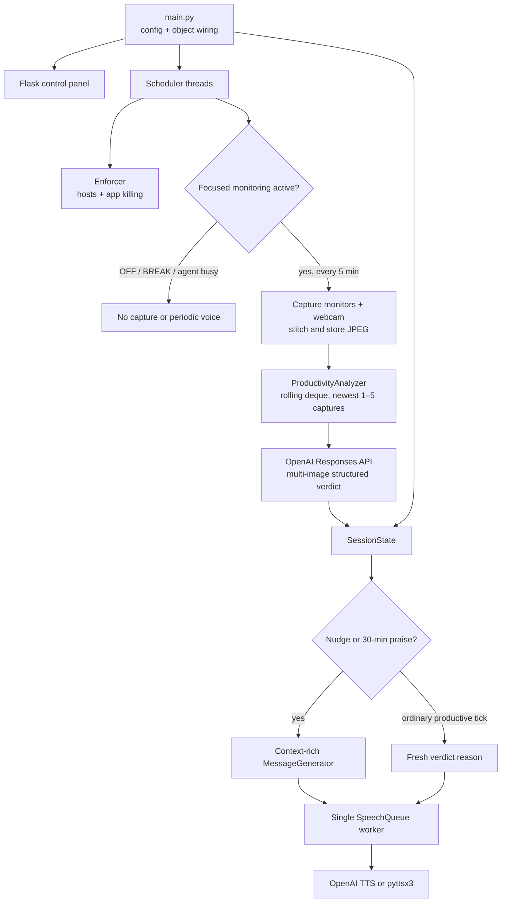

# Deep Work: Windows Productivity Enforcement App

Holds you to deep focus on Windows 11: blocks distracting websites, kills
distraction apps, compares a rolling history of your screens + webcam for
visible progress, and speaks a fresh encouragement or gentle nudge every five
minutes, all controlled from a small local web panel.


## Features

1. **Website blocking**: Reddit, YouTube, Twitter/X, Discord, Hacker News,
   LinkedIn, Bluesky, Substack, Facebook, LessWrong, EA Forum and 4chan (plus
   known variants like `old.reddit.com`, `youtu.be`, `x.com`) are redirected
   to `127.0.0.1` via the Windows hosts file, IPv4 and IPv6, inside a fenced
   `# >>> deepwork block` section that is cleanly removed on OFF/exit.
2. **App killing**: a background sweep terminates Discord, Telegram and
   Steam every 3 seconds while enforcement is on.
3. **Rolling progress monitoring**: every 5 minutes all monitors and the
   webcam are captured and stitched into one labeled image. Every capture
   triggers an OpenAI vision evaluation over the newest 1–5 captures, ordered
   oldest to newest; after warm-up, this is always the latest 25-minute
   window. The coach compares documents, code, tests, research and other
   visible task state for real progress. A full on-topic window with no
   meaningful progress gets a gentle stalled-work nudge, while plausible
   reading/thinking work is not rejected merely for looking static.
4. **Spoken feedback every 5 minutes**: an immediate LLM-written good-luck
   message starts the session, then every successful monitoring evaluation
   produces exactly one spoken update. Ordinary productive checks speak the
   fresh vision reason directly; distraction or stalled work gets a
   context-rich nudge; every 30 consecutive productive minutes gets praise.
   Voice pauses while OFF, on BREAK, or while an agentic coding agent is busy.
   OpenAI TTS voices are AI-generated, not human. Offline `pyttsx3` remains
   available via `TTS_ENGINE=pyttsx3`.
5. **Modes**: **ON** (everything enforced), **OFF** (nothing), **BREAK**
   (timed, auto-restoring; you state what it's for and how long, TTS
   acknowledges). Breaks can allow only specific sites/apps
   (`reddit,discord`) while everything else stays blocked, and come in two
   kinds: *social media* (draws from a **2 h/day allowance**, refused once
   exhausted) or *away from computer*. A `projects.json` file can allowlist
   specific social sites for a named productive project while ON.
6. **Confirmation phrase** : turning enforcement off requires typing exactly
   `I will not stop cool deepwork session`.
7. **Web UI**: `http://127.0.0.1:5599` (port via `UI_PORT`): topic input
   with a dropdown of previous topics, break and disable forms, live status.
8. **Agentic engineering mode**: tick *agentic engineering* when starting a
   session (or toggle mid-session). A vision check every 60 s
   (`AGENT_CHECK_INTERVAL_S`) watches your screens for an AI coding agent
   (Claude Code, Cursor, terminal agents) that is actively working — spinner,
   streaming output, running tools. While it works, **everything unblocks**
   so you can scroll Twitter guilt-free; the moment it finishes or waits for
   your input, the full blocklist snaps back and the voice calls you over to
   review. Waiting time is free (no 2 h allowance drain), and productivity
   nudges pause while the agent runs. Cost: one low-detail capture per
   minute, a few cents per workday.
9. **Results storage**: `results/captures/*.jpg` (stitched images),
   `results/llm/*.json` (full, uncut LLM request/response pairs),
   `results/sessions/*.jsonl` (timestamped event log), `results/state.json`
   (allowance + topic history, survives restarts). Runtime logs stream to the
   terminal and `logs/deepwork_*.log` simultaneously.

## Architecture

`main.py` remains the readable wrapper that wires configuration, state,
storage, enforcement, monitoring, feedback and the local web UI. The rolling
monitoring path is:



## Requirements

- Windows 11 (hosts file, winsound, UAC elevation are Windows-specific)
- [uv](https://docs.astral.sh/uv/) (Python 3.13 is pinned via `.python-version`)
- An OpenAI API key with access to a vision-capable model and TTS

## Setup

```powershell
git clone <this-repo> deep-work
cd deep-work
uv sync                      # creates ./.venv and installs everything
copy .env.example .env       # then edit .env and set OPENAI_API_KEY
```

All configuration lives in `.env`: see `.env.example` for every variable
(models, reasoning effort, intervals, rolling progress-window size, TTS
engine/voice, allowance cap, UI port). Productivity evaluation defaults to
`VISION_MODEL=gpt-5.6-sol` with `PROGRESS_REASONING_EFFORT=xhigh`;
`PROGRESS_WINDOW_CAPTURES=5` means each evaluation compares up to the five
latest captures. The frequent agent-busy poll remains on
`AGENT_VISION_MODEL=gpt-5.4-mini`. Older `.env` files using `BATCH_SIZE`
still work.

## Run

**Easiest:** double-click **`Start Deep Work.bat`** in Explorer: it asks for
administrator permission once (UAC), starts the app with live logs in a
console window, and opens the control panel in your browser. Closing that
window stops the app and restores the hosts file.

Or from a terminal:

```powershell
uv run pytest                      # unit tests: no admin, no API key, no hardware
uv run python main.py --smoke      # one real capture→vision→speech cycle, then exits
uv run python main.py --dry-hosts  # full app but hosts changes are only logged (no admin)
uv run python main.py              # full app: shows ONE UAC prompt, then the web panel
```

Then open **http://127.0.0.1:5599**, type what you'll work on, press
**Start**: you'll hear your good-luck message immediately, then a fresh
progress-aware voice update after each five-minute monitoring tick.

### Optional: per-project social allowlist

Create `projects.json` in the repo root, e.g.:

```json
{"ml-research": ["twitter"], "community": ["discord", "bluesky"]}
```

Selecting that project on Start keeps everything blocked *except* those site
groups. Valid group names are the keys of `SITE_DOMAINS` in
`deepwork/config.py` (reddit, youtube, twitter, discord, hackernews,
linkedin, bluesky, substack, facebook, lesswrong, eaforum, 4chan).

## Verifying it works (manual smoke checklist)

1. `uv run python main.py` → accept the UAC prompt.
2. Start a session; check `C:\Windows\System32\drivers\etc\hosts` now has the
   `# >>> deepwork block start` section and `ping reddit.com` answers from
   `127.0.0.1`.
3. Launch Discord or Steam: it dies within ~3 s.
4. Take a 1-minute social break allowing `reddit`: TTS acknowledges, Reddit
   unblocks, and a minute later blocking auto-restores (watch the log).
5. `/disable` with a wrong phrase → refused (403). With the exact phrase →
   everything off and the hosts section removed.
6. Run `uv run python main.py --smoke`: one real capture is evaluated and
   spoken exactly once.
7. Inspect `logs/` and `results/llm/`: every LLM prompt and full response is
   there, untruncated.

## Known limitations & caveats

- **Browser "Secure DNS" (DoH) bypasses hosts blocking.** Disable it in
  Chrome/Edge/Firefox settings (or enforce DoH at the Windows level) or
  blocked sites will still load. Also clear `chrome://net-internals/#dns`
  after toggling. ([background](https://www.howtogeek.com/784196/how-to-edit-the-hosts-file-on-windows-10-or-11/))
- **Windows Defender** may flag hosts edits as
  `SettingsModifier:Win32/HostsFileHijack`: allow the change (it's this app).
- **Per-author `*.substack.com` subdomains** can't be enumerated in a hosts
  file; only `substack.com` itself is blocked.
- **Hard kills skip cleanup.** `atexit` restores the hosts file on normal
  exit/Ctrl+C, but after a hard kill remove the fenced
  `# >>> deepwork block` section from
  `C:\Windows\System32\drivers\etc\hosts` by hand (as admin) and run
  `ipconfig /flushdns`.
- **Model names churn.** `VISION_MODEL`/`AGENT_VISION_MODEL`/`TEXT_MODEL`/
  `TTS_MODEL` are plain `.env` strings: check the
  [OpenAI model guide](https://developers.openai.com/api/docs/guides/latest-model)
  and [pricing page](https://developers.openai.com/api/docs/pricing) when
  models are retired or when tuning quality, latency, and cost.
- **Cost**: after warm-up, one vision request containing five low-detail
  images and one TTS request run every five minutes of focused work. This is
  intentionally more API usage than the old once-per-25-minute batch.
  GPT-5.6 Sol at `xhigh` prioritizes evaluation quality over latency and cost;
  lower `PROGRESS_REASONING_EFFORT` after representative testing if desired.
  [OpenAI documents](https://developers.openai.com/api/docs/guides/images-vision#giving-a-model-images-as-input)
  that every image in a multi-image request counts toward billed tokens.

## Development

See `AGENTS.md` for architecture, module map, conventions (TDD, dependency
injection, source-linked comments) and gotchas. Tests: `uv run pytest`.
