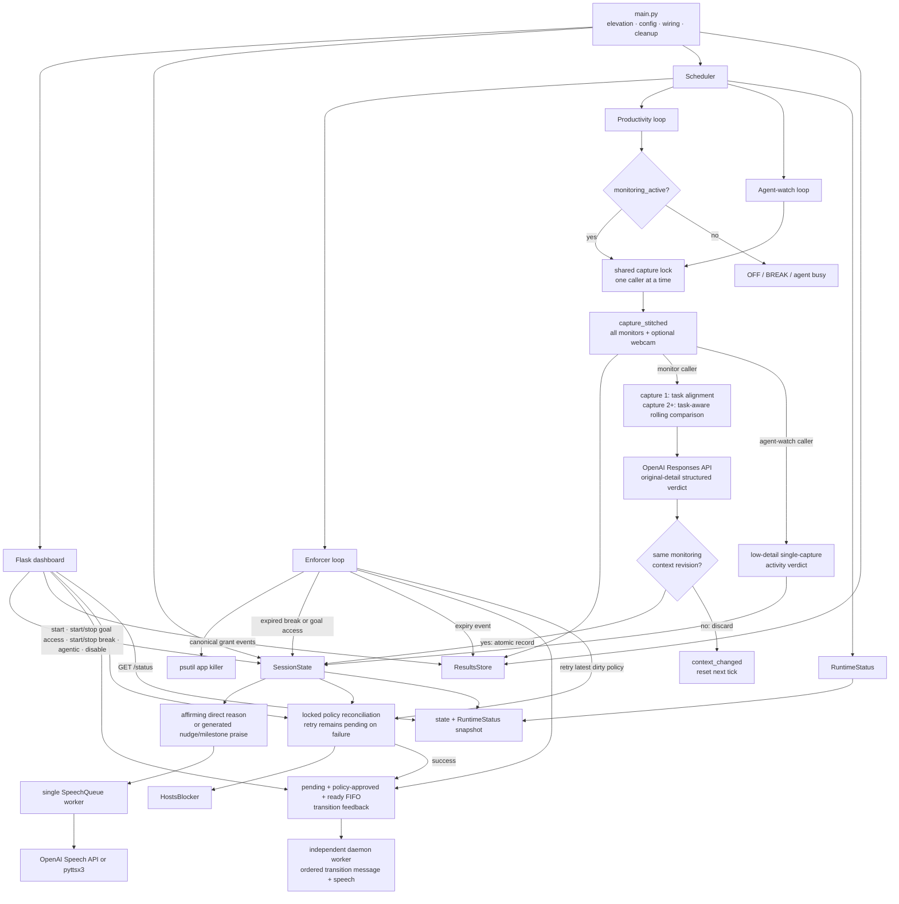

# Deep Work: Windows Productivity Enforcement

Deep Work is a personal Windows 11 focus app. During a focused session it
blocks configured website domains through the Windows hosts file, terminates
named distraction apps, periodically captures every monitor and an optional
webcam frame, asks an OpenAI vision model for a structured productivity
verdict, and speaks feedback. A local Flask dashboard controls the session and
shows current state and scheduler health.


This is an enforcement aid, not a security boundary. The blocklist is explicit,
the AI can be wrong, and anyone with administrator access can undo the policy.

## Implemented behavior

1. **Website blocking**
   - The configured groups are Reddit, YouTube, Twitter/X, Discord, Hacker
     News, LinkedIn, Bluesky, Substack, Facebook, LessWrong, EA Forum, and
     4chan.
   - `deepwork/config.py` expands those groups into explicit hostnames. There
     is no wildcard matching.
   - `HostsBlocker` writes both `127.0.0.1` and `::1` entries inside a
     marker-fenced `# >>> deepwork block start` section, then runs
     [`ipconfig /flushdns`](https://learn.microsoft.com/en-us/windows-server/administration/windows-commands/ipconfig).
   - Session, temporary-access, break, and agent transitions mark a new desired
     policy. One locked reconciliation writes the newest policy immediately;
     if that write fails, `/status.enforcement.reconciliation_pending` remains
     true and the enforcer retries it on a later tick without letting an older
     write overwrite newer state. `/disable` requests fenced-section removal,
     and normal interpreter shutdown also removes it.

2. **Distraction-app termination**
   - While mode is ON or BREAK, the enforcer checks every
     `KILL_INTERVAL_S` seconds and kills exact, case-insensitive process-name
     matches for Discord, Telegram, and Steam.
   - A break can spare selected app groups. Stopping it restores the normal
     process targets for the next enforcer tick. Task-scoped website access and
     agentic waiting do **not** spare desktop apps.

3. **Rolling progress evaluation**
   - On each active monitor tick, `mss` captures every physical monitor.
     OpenCV contributes one webcam frame when camera capture succeeds; webcam
     failure is non-fatal.
   - The images are stacked into one timestamped, labeled JPEG.
   - Productivity images are sent with `detail="original"`. With the default
     GPT-5.6 model, this preserves the supplied dimensions so dense document,
     code, and UI changes remain available to the model. The agent watcher
     remains a separate low-detail workload.
   - A successful capture triggers one Responses API evaluation over the newest
     one through `PROGRESS_WINDOW_CAPTURES` stitched captures, oldest first,
     provided its versioned monitoring context still matches. A transition
     during capture discards it before model work.
   - The first capture judges only current task alignment and engagement; it
     cannot establish progress or a stall. From the second capture onward, the
     model compares corresponding monitor and webcam panels across the whole
     available oldest-to-newest window. `PROGRESS_WINDOW_CAPTURES` is the
     maximum retained history, not a prerequisite for comparison.
   - The comparison is task-aware. Coding, writing, editing, note-taking,
     debugging, and active research normally need meaningful task-relevant
     changes; an unchanged scene with no other aligned evidence can be judged
     stalled from capture two. Reading, thinking, calls, physical work, and
     visibly running builds, tests, or training may remain productive only when
     concrete topic-aligned evidence supports genuine engagement; vague tasks do
     not justify an invented static-work exception. Timestamps, clocks, cursors,
     animations, webcam lighting, minor posture changes, and unrelated visible
     changes do not establish progress.
   - With the defaults, comparison begins on the second successful
     same-context tick, while the fifth is the first maximum-length
     five-capture window. Its nominal oldest-to-newest span is at least about
     20 minutes and it completes at least about 25 minutes after an
     uninterrupted loop begins; capture and API latency extend both timings.

4. **Spoken feedback**
   - Starting a session generates and queues an LLM-written good-luck message.
     Starting or manually stopping a break queues a context-grounded
     acknowledgment. These state-transition messages and temporary-access
     acknowledgments share one FIFO worker, so a later break or session message
     cannot overtake an earlier grant transition.
   - Starting temporary goal access, completing it manually, or reaching its
     timer records the complete lifecycle event immediately and requests one
     context-grounded acknowledgment only after hosts reconciliation succeeds.
     A shared ordered in-memory queue preserves start/end speech across a
     transient enforcement failure. Requests are bound to policy revisions: a
     successful reconciliation approves messages that its applied policy makes
     true, while a failed permission transition superseded by a newer policy is
     dropped rather than announced. Approved requests reach the separate
     transition worker, so model/TTS latency cannot hold the policy lifecycle
     lock or delay expiry. Model/TTS failure is logged without
     rolling state back or retrying the utterance. If opening enforcement never
     succeeds before the grant ends, its now-stale start acknowledgment is
     cancelled; the canonical start and end events remain recorded.
   - Each successful productivity evaluation queues exactly one utterance.
     An ordinary productive verdict speaks the vision model's reason directly;
     that reason is prompted to integrate a brief, naturally varied affirmation
     tied to the observed work before naming its concrete evidence. A
     single-capture reason may praise current engagement but cannot claim
     progress over time. From the second capture onward, progress praise
     requires task-relevant chronological evidence; when only engagement is
     supported, the model praises the engagement or focus instead. An off-track
     verdict or 30-minute streak milestone first uses the text model to generate
     a context-grounded nudge or richer praise.
   - At the default cadence, each productive verdict credits five streak
     minutes. Six consecutive productive verdicts trigger praise and reset the
     streak counter. This is configured-interval accounting, not measured
     foreground activity time.
   - OFF, BREAK, and agent-busy states pause new periodic evaluations. They do
     not cancel speech that was already queued.
   - `TTS_ENGINE=openai` uses the Speech API; `TTS_ENGINE=pyttsx3` changes only
     playback to offline Windows speech. Vision and message generation still
     require OpenAI. The dashboard discloses that OpenAI speech is
     AI-generated, as required by the
     [OpenAI TTS guide](https://developers.openai.com/api/docs/guides/text-to-speech).

5. **ON, OFF, and BREAK modes**
   - **ON:** desired website blocking, app termination, and productivity
     monitoring are active. `/status` identifies any pending hosts
     reconciliation.
   - **OFF:** entering this mode through `/disable` requests removal of the
     hosts section, and monitor/app enforcement ticks do no work. A failed
     removal remains pending for a later enforcer retry.
   - **BREAK:** monitoring pauses until the timed break expires or the user
     selects **Stop break and resume work**. Task-required sites remain open,
     and the break can add selected site/app exceptions.
   - A positive social-media break submitted through the provided form reserves
     its requested minutes immediately against the local-date daily allowance
     (120 minutes by default). A positive request beyond the remaining
     allowance is refused. Manually stopping refunds unelapsed reserved minutes
     and charges every started minute, rounded up and capped at the requested
     duration. Natural expiry keeps the full reservation. Away breaks do not
     spend that allowance.
   - Turning enforcement off requires the exact, case-sensitive phrase:
     `I will not stop cool deepwork session`.

6. **Task-scoped website access**
   - The Start form accepts checked site groups and an optional
     `projects.json` preset. Their ordered, deduplicated union stays open for
     that focused session.
   - These sites remain monitored, do not spend social-break minutes, and do
     not exempt desktop apps.
   - Task and preset keys are validated server-side. Starting another session
     resets the one-off choices.

7. **Repeatable temporary goal access**
   - During an ON session, the dashboard can open any configured website
     groups for a required subgoal. One grant may be active at a time, but
     completing or expiring it immediately permits another; there is no
     per-session count or cumulative-minute limit.
   - A grant lasts for 1–240 wall-clock minutes or until the current session
     ends. It leaves the session in ON mode, spends no social-break allowance,
     never spares desktop apps, and does not itself pause productivity
     monitoring.
   - The analyzer receives the exact subgoal and temporary site groups.
     Visiting an allowed site is productive only when the visible activity
     serves both the session topic and the stated subgoal.
   - Every relevant state transition changes a versioned monitoring context.
     The next monitor tick resets its rolling window; if that context changes
     during capture or model analysis, the stale verdict, event, and speech are
     discarded and the following tick starts with the new context.
   - BREAK preserves the grant but suspends its website exceptions while the
     timer continues. An unexpired grant resumes when the break ends; an
     expired grant does not. Suspension removes only the grant's permission;
     permanent task, break, or agentic policy can still keep an overlapping
     site open.

8. **Agentic engineering mode**
   - An optional watcher uses the same stitched monitor/webcam capture path and
     a low-detail vision request every `AGENT_CHECK_INTERVAL_S` seconds.
   - When the latest verdict changes to "agent working," the **website**
     blocklist becomes empty and productivity monitoring pauses. The app killer
     continues.
   - When the watcher later observes an idle, finished, or input-waiting agent,
     normal website restrictions return while task-required sites remain open,
     and one transition message is spoken.
   - Detection occurs on scheduled polls, not instantly, and AI classification
     can be wrong. Agentic waiting does not spend social-break allowance.

9. **Local realtime dashboard**
   - The Flask development server binds only to `127.0.0.1` and defaults to
     port `5000` through `UI_PORT`.
   - The browser requests the no-cache `/status` JSON endpoint every three
     seconds, never overlaps polls, pauses polling in a hidden tab, and keeps
     the last good view during a temporary connection failure.
   - It displays session state, permanent and temporary task access, break and
     agent state, desired enforcement counts and reconciliation state,
     current-session verdict history, and the cadence/result/error state of all
     scheduler loops.

10. **Local artifacts and logs**
   - `results/captures/*.jpg`: stitched productivity and agent-watch captures.
   - `results/llm/*.json`: full successful model response objects and complete
     textual prompts. Image request payloads refer to the separately stored
     JPEG paths instead of duplicating base64 data.
   - `results/sessions/*.jsonl`: serialized timestamped session events;
     transient failed lines remain queued in memory for retry.
   - `results/state.json`: daily social usage and previous topics only.
   - `logs/deepwork_*.log`: timestamped runtime logs, also streamed to the
     terminal.

## Architecture

`main.py` is the orchestration wrapper. It performs elevation, configuration
and logging, blocker selection, object wiring, cleanup registration, and run
mode selection. Domain behavior is in `deepwork/`.



The scheduler uses fixed-delay loops: each loop waits its configured interval,
runs the blocking tick, then waits again. Capture/API duration therefore adds
to the wall-clock time between tick starts, and session Start does not reset
the global loop countdown.

All state-changing routes and scheduler transitions publish hosts policy
through the same state-owned reconciliation lock. A failed backend call keeps
the latest desired policy dirty for a later enforcer retry; while it is
pending, the desired dashboard counts can differ from the hosts file.

The productivity and agent-watch loops share one capture lock because
[OpenCV documents `VideoCapture` as non-thread-safe](https://docs.opencv.org/master/d0/db6/tutorial_orbbec_astra_openni.html).
The lock covers only the injected screen/webcam capture call, so an overlapping
request waits for the active capture to finish; saving, model analysis, state
updates, and speech remain outside the lock.

## Requirements

- Windows 11. Hosts-file editing, UAC elevation, DirectShow camera capture, and
  `winsound` playback are Windows-specific.
- [uv](https://docs.astral.sh/uv/) and internet access. `.python-version`
  selects Python 3.13; uv creates the project-local `.venv`.
- An OpenAI API key with access to the configured text/image and speech
  models.
- Administrator approval for real hosts-file enforcement.
- A camera and audio output are optional; missing webcam input is tolerated,
  while speech failures are logged.

## Install

```powershell
git clone https://github.com/BurnyCoder/jarvis-waifu-supervisor.git deep-work
cd deep-work
uv sync --locked
Copy-Item .env.example .env
# Edit .env and replace the placeholder OPENAI_API_KEY.
```

`uv sync --locked` reproduces the checked-in lockfile in `./.venv`; use plain
`uv sync` after intentionally changing dependencies. See the
[uv project guide](https://docs.astral.sh/uv/guides/projects/) for the
environment and lockfile behavior.

### Configuration

`.env` contains the runtime tunables:

| Variable | Default | Purpose |
|---|---:|---|
| `OPENAI_API_KEY` | none | Required API credential |
| `VISION_MODEL` | `gpt-5.6-sol` | Rolling productivity vision model; must support original image detail |
| `PROGRESS_REASONING_EFFORT` | `xhigh` | Productivity-model reasoning effort |
| `AGENT_VISION_MODEL` | `gpt-5.6-sol` | Frequent agent-activity vision model |
| `AGENT_REASONING_EFFORT` | `xhigh` | Agent-activity reasoning effort |
| `TEXT_MODEL` | `gpt-5.6-sol` | Good-luck/nudge/milestone-praise message model |
| `TEXT_REASONING_EFFORT` | `xhigh` | Feedback-message reasoning effort |
| `TTS_ENGINE` | `openai` | `openai` or `pyttsx3` playback |
| `TTS_MODEL` | `gpt-4o-mini-tts` | OpenAI speech model |
| `TTS_VOICE` | `coral` | OpenAI speech voice |
| `CAPTURE_INTERVAL_S` | `300` | Fixed delay before each productivity tick |
| `PROGRESS_WINDOW_CAPTURES` | `5` | Maximum rolling comparison history (minimum 2); comparison starts at capture 2 |
| `KILL_INTERVAL_S` | `3` | Fixed delay before each enforcement tick |
| `AGENT_CHECK_INTERVAL_S` | `60` | Fixed delay before each agent-watch tick |
| `DAILY_SOCIAL_CAP_MIN` | `120` | Daily social-break reservation cap |
| `UI_PORT` | `5000` | Loopback dashboard port |

`BATCH_SIZE` remains a compatibility fallback for
`PROGRESS_WINDOW_CAPTURES`. The hosts path, website/app tables, and disable
phrase are code constants rather than `.env` settings.

All Responses API text and vision calls default to
[GPT-5.6 Sol](https://developers.openai.com/api/docs/models/gpt-5.6-sol) with
`xhigh` reasoning. These quality-first defaults can increase latency and cost,
especially for the one-minute agent watcher; each workload therefore keeps
separate `.env` overrides. Sol produces text rather than speech, so TTS remains
on the dedicated
[GPT-4o mini TTS](https://developers.openai.com/api/docs/models/gpt-4o-mini-tts).
`VISION_MODEL` is the constrained override: productivity requests always use
`detail="original"`, which OpenAI currently documents for GPT-5.4 and future
models. Choose a model with that capability and retest if the default is not
available; an unsupported override makes productivity evaluation fail rather
than silently lowering image detail. Agent-vision and text overrides do not
inherit that original-detail requirement. Model access and lifecycle can vary,
so verify overrides against the current
[vision guide](https://developers.openai.com/api/docs/guides/images-vision#choose-an-image-detail-level).

## Run

### Terminal (recommended)

```powershell
uv run pytest                      # hardware/network/admin-free unit suite
uv run python main.py --smoke      # one real capture -> vision -> speech tick
uv run python main.py --dry-hosts  # full UI; hosts changes are logged only
uv run python main.py              # real UAC + hosts enforcement + local UI
```

`--smoke` uses real screen/webcam capture and the configured OpenAI models. It
stores and uploads the capture just like a normal productivity tick. It skips
administrator elevation and uses the dry-run hosts blocker.

`--dry-hosts` is dry only for hosts-file writes. After a session starts it can
still terminate configured apps, capture and upload monitor/webcam images,
call the configured models, store artifacts, and play speech.

For a normal run:

1. Accept the UAC prompt.
2. Read the logged `control panel:` URL and open
   `http://127.0.0.1:<UI_PORT>`.
3. Enter a topic, choose only task-required sites, optionally enable agentic
   mode, and select **Start session**.
4. When a blocked site becomes necessary, enter a concrete goal, select the
   site groups, choose a timer or session-end duration, and start temporary
   access. Select **Goal complete — stop access** when finished; another grant
   can then start immediately.
5. Start a timed break when needed. An active goal grant is suspended while
   the break runs and resumes only if its wall-clock timer has not expired.
6. Use Ctrl+C for a normal shutdown so the registered cleanup can clear the
   hosts section. Do not assume that closing or killing the console will run
   cleanup.

The server is Flask's development server and is intentionally loopback-only.
It has no authentication or CSRF defense. Do not expose it to a network without
adding production serving, authentication, and request protections; Flask says its
[development server is not for production](https://flask.palletsprojects.com/server/).

### Double-click launcher

`Start Deep Work.bat` self-elevates, checks that `uv` is on `PATH`, and runs
`uv run python main.py`. Its browser helper is currently hardcoded to
`http://127.0.0.1:5599`, while the application and `.env.example` default to
port `5000`. Set `UI_PORT=5599`, update the URL in the batch file, or open the
actual logged URL manually.

During the 2026-07-20 audit, `wslrelay` was also observed occupying port
`5000` on the development workstation; choosing another `UI_PORT` is the
appropriate remedy when that conflict is present.

## Dashboard and `/status`

Productivity history is scoped to the current in-memory session:

- Every completed evaluation appears newest-first with its timestamp,
  productive/off-track label, complete reason, and expandable observation.
- BREAK and OFF preserve the last session's timeline for review.
- Starting another session clears the timeline and latest verdict.
- Restarting the Python process clears dashboard verdict history; durable
  verdict events remain in `results/sessions/*.jsonl`.

Inspect the JSON endpoint directly:

```powershell
$port = 5000  # replace with UI_PORT
Invoke-RestMethod "http://127.0.0.1:$port/status"
```

The dashboard renders LLM text with `textContent` and does not expose saved
capture images or raw prompt files through an HTTP route.

`goal_access` is additive in `/status`. It is `null` when no grant is active;
otherwise it reports `goal`, `allowed_sites`, `allowed_site_labels`,
`started_at`, optional `expires_at`, `requested_minutes`, `remaining_s`,
`until_session_end`, and whether BREAK currently makes `suspended` true.
`enforcement.reconciliation_pending` reports whether the desired hosts policy
still needs a successful backend write.

## Task-required sites and presets

Create an optional `projects.json` beside `main.py`:

```json
{
  "ml-research": ["twitter", "linkedin"],
  "community": ["discord", "bluesky"]
}
```

Valid keys are:

```text
reddit youtube twitter discord hackernews linkedin
bluesky substack facebook lesswrong eaforum 4chan
```

A preset is unioned with one-off Start-form selections. Invalid JSON, an
invalid shape, an unknown preset, or an unknown task/preset site key fails
before the session can weaken enforcement. One-off task access is intentionally
excluded from `results/state.json`.

## Temporary goal access

`POST /goal-access` accepts a non-empty `goal`, repeated validated
`allowed_sites` keys, `duration_mode` equal to `timed` or `session_end`, and a
whole `minutes` value from 1 through 240 for timed grants. It succeeds only
during ON mode when no other grant is active. `POST /goal-access/stop` has no
fields and is safe to repeat.

Only the active immutable grant record is held in memory. Its start event
contains the full goal, site keys and labels, and timing; the end event repeats
those fields and adds its end time and reason in the session JSONL. Starting
another session, successfully disabling state, or a normal registered shutdown
ends and records the active grant. Restarting the Python process restores
neither sessions nor grants; a hard termination can still skip shutdown cleanup
and its end event.

Every start/manual-stop/expiry transition records its canonical event before
hosts reconciliation. If the backend raises, a route returns HTTP 503 and the
enforcer retries. A still-relevant transition acknowledgment remains pending
and is published once after a supporting reconciliation succeeds. Messages are
bound to the policy revision they describe, so a failed permission transition
superseded by a newer applied policy is discarded instead of falsely announced.
If an unapplied grant ends through stop, expiry, replacement, Disable, or shutdown first, its
stale start acknowledgment is cancelled rather than spoken. Published requests
are generated by an ordered daemon worker outside the lifecycle lock.
Consequently, dashboard state describes the desired policy; check
`enforcement.reconciliation_pending` before treating it as confirmation of the
Windows hosts file.

Session JSONL appends are serialized and retain complete timestamped lines in
memory after a transient write failure. Routes and expiry still apply the newest
hosts policy immediately; the enforcer retries the event, and the matching
transition acknowledgment waits until earlier events are durable. Partial or
close-time appends are truncated back to the prior line boundary before retry,
preventing duplicate/corrupt rows. Hard process termination can still lose
in-memory retries.

Break exceptions use comma-separated group keys in the dashboard. The current
break route relies on browser-side duration/type constraints and does not
perform the strict task/preset validation. A forged request can therefore
submit an invalid duration or kind; unknown break keys have no effect rather
than producing an error. Use a positive duration, kind `away` or
`social_media`, the site keys above, and app keys `discord`, `telegram`, and
`steam`. `POST /break/stop` has no form fields and is safe to repeat after the
break has already ended. A manual social-break stop bills elapsed started
minutes and records requested, elapsed, charged, and refunded values in the
session JSONL event.

## Data, privacy, and cost

- Each productivity vision request uploads the current rolling set of one
  through `PROGRESS_WINDOW_CAPTURES` stitched JPEGs to OpenAI. Each JPEG contains
  every monitor and, when capture succeeds, a webcam frame. An agent-watch
  request uploads one stitched JPEG. Topics, temporary access goals,
  allowed-site context, observations, and feedback prompts are also sent.
- `TTS_ENGINE=pyttsx3` keeps audio synthesis local but does **not** make the
  rest of the application offline.
- Captures, logs, exchange JSON, and state are ordinary unencrypted local
  files. They may contain sensitive screen, webcam, topic, and model-output
  data. Protect the Windows account and delete old artifacts deliberately.
- `.env`, `logs/`, and `results/` are gitignored. Never force-add them.
- The app does not calculate spend. The first successful productivity tick in
  each monitoring context uses a one-image vision request; later same-context
  ticks use one multi-image request and resend the retained rolling history, up
  to the configured maximum. Each successful tick also queues one speech
  request; off-track nudges and 30-minute
  streak-milestone praise add a text-generation request. Each normally
  reconciled goal-access start/manual stop/expiry generates one transition
  message and queues one speech; failures can prevent a downstream call.
  Agentic mode adds polling vision requests and transition message/speech
  requests.
- Productivity images use `detail="original"` while agent-watch images use
  `detail="low"`. OpenAI documents that GPT-5.6 preserves supplied dimensions
  at original detail, and that large images can use more input tokens and add
  latency. OpenAI meters each image as input tokens, and tokenization depends on
  model, dimensions, and detail. Use the current
  [vision guide](https://developers.openai.com/api/docs/guides/images-vision)
  and [deployment checklist](https://developers.openai.com/api/docs/guides/deployment-checklist#set-image-detail-intentionally)
  and [pricing page](https://developers.openai.com/api/docs/pricing) instead
  of relying on a fixed per-day estimate.

## Verification

### Automated

```powershell
uv run pytest
uv run python main.py --help
```

The unit suite uses fakes and temporary paths; it does not require
administrator access, an API call, capture hardware, or audio playback.

### Manual end-to-end checklist

1. Start `uv run python main.py`, accept UAC, and open the logged dashboard URL.
2. Start a session allowing `twitter` and `linkedin`.
3. Inspect `C:\Windows\System32\drivers\etc\hosts`: the fenced section should
   omit the selected groups, include an unselected domain such as `reddit.com`,
   and contain both IPv4 and IPv6 loopback entries.
4. Confirm an unselected hostname resolves to `127.0.0.1` or `::1`, then test
   the actual browser because browser-level resolution and caches can differ.
5. Launch Discord or Steam; an exact configured process should be terminated
   on an enforcement tick.
6. Start a timed temporary grant for `reddit` with a concrete goal. Confirm
   Reddit opens, monitoring stays active, desktop apps remain targeted, social
   allowance is unchanged, and `/status.goal_access` counts down. Complete it,
   start another grant immediately, and confirm both cycles have independent
   start/end events and spoken acknowledgments.
7. Start a temporary grant, then start a break. Confirm a grant-only site
   re-blocks during BREAK, an overlapping task/break-permitted site remains
   open, the wall-clock countdown continues, and the grant resumes only when
   the break ends before expiry.
8. Start a ten-minute social break allowing `reddit`; confirm the full
   reservation is deducted immediately and monitoring pauses. Stop it after a
   few seconds; confirm one minute remains charged, the other nine are
   refunded, `reddit` is re-blocked, monitoring resumes, and a return-to-work
   message is spoken. Also let a later one-minute break expire and confirm its
   full reservation remains charged.
9. Submit a wrong disable phrase and confirm HTTP 403/state remains ON; submit
   the exact phrase and confirm the fenced hosts section is removed.
10. Run `uv run python main.py --smoke` and inspect the newest files under
    `logs/`, `results/captures/`, `results/llm/`, and `results/sessions/`.
11. Verify that the stored prompt describes permanent and temporary task sites
    conditionally and includes the complete temporary goal. For a productive
    result, confirm its reason includes a natural affirmation grounded in
    concrete evidence, does not invent change over time from the single
    capture, and matches the recorded and spoken line. A smoke run contains only
    one productivity capture and cannot verify chronological comparison.
12. Keep a normal session in one unchanged monitoring context through at least
    two successful productivity ticks. Inspect the second stored productivity
    exchange: with the default window it should identify `COMPARISON (2/5)`,
    contain two oldest-first image references with `detail="original"`, and
    compare corresponding panels using evidence appropriate to the stated task
    rather than waiting for a five-capture window.
13. With a fake blocker that fails once, verify the mutating route returns 503,
    `/status.enforcement.reconciliation_pending` becomes true, and a later
    enforcer tick writes only the newest desired policy and clears the flag.

## Known limitations

- **Explicit hosts only:** hosts files do not support wildcard domain policy.
  Unlisted subdomains, alternate domains, direct IP access, proxies, VPNs, or
  application-specific resolvers can bypass or partially defeat blocking.
  For Substack, this project covers `substack.com` and `www.substack.com`, not
  arbitrary author subdomains. Temporary goal access likewise opens whole
  configured hostname groups; it cannot technically confine browsing to the
  written goal or a particular post.
- **DoH behavior varies by resolver:** Microsoft's
  [Windows resolver documentation](https://learn.microsoft.com/en-us/troubleshoot/windows-client/networking/troubleshoot-dns-client-resolution-issues)
  says the DNS client checks its cache and hosts file before querying DNS, but
  software that uses its own resolver can bypass the Windows path. Mozilla
  documents that
  [Firefox DoH can bypass local DNS filtering](https://support.mozilla.org/en-US/kb/firefox-dns-over-https).
  If a blocked site still resolves, inspect that browser's secure-DNS mode and
  cache rather than assuming every browser behaves alike.
- **Process names are finite:** renamed executables, web versions, helper
  processes not listed in `APP_PROCESSES`, and protected processes are outside
  the current app-killer policy.
- **Vision judgments remain fallible:** the productivity analyzer sends
  `detail="original"` so the default GPT-5.6 model preserves the supplied image
  dimensions, but this does not make its verdict ground truth. Wide stitched
  JPEGs, compression, occlusion, visually ambiguous activity, and work whose
  progress is not observable can still produce an incorrect verdict. The
  frequent agent watcher intentionally remains low-detail and can miss small
  screen text.
- **Fixed-delay timing:** API and capture latency extend the real interval.
  Agent completion can remain undetected until a later watcher tick, and a
  timed goal grant closes on the first later enforcer tick rather than at an
  exact wall-clock instant. Goal-access acknowledgment generation runs on a
  separate worker and therefore does not delay the enforcer or extend a grant.
- **Hosts writes can fail:** state and session events can advance before the
  Windows hosts file is updated. The dashboard exposes this as
  `enforcement.reconciliation_pending`, and the enforcer retries, but access is
  not confirmed until a write succeeds. Still-relevant ordered acknowledgments
  wait in process memory for a successful reconciliation; an unapplied start is
  dropped if its grant ends first. Hard termination can lose pending or queued
  speech, while canonical JSONL events already written remain available.
- **Artifact writes can fail:** transient session-JSONL failures retain complete
  lines in memory and are retried without delaying hosts enforcement. Matching
  transition speech waits behind those lines, but hard termination before a
  successful retry can still lose the in-memory event and acknowledgment.
- **Break validation is incomplete:** HTML constrains normal form input, but
  `/break` does not validate the duration range, kind, or exception keys
  server-side. In particular, a forged negative social duration can corrupt
  allowance accounting. Keep the panel loopback-only and treat server-side
  validation as required follow-up work.
- **Cleanup is best-effort:** Python
  [`atexit`](https://docs.python.org/3.13/library/atexit.html) handlers do not
  run after every kind of hard termination. If cleanup was skipped, remove the
  fenced section as Administrator and run `ipconfig /flushdns`.
- **Defender may object:** Microsoft documents
  [`SettingsModifier:Win32/HostsFileHijack`](https://www.microsoft.com/en-us/wdsi/threats/malware-encyclopedia-description?Name=SettingsModifier%3AWin32%2FHostsFileHijack)
  for suspicious hosts-file changes. Confirm that a detection corresponds to
  this intentional edit before taking any exclusion action.
- **Launcher port mismatch:** the batch helper opens `5599`; the application
  default is `5000`.

## Development

Read `AGENTS.md` for repository workflow, invariants, module ownership,
verification expectations, and current gotchas. `CLAUDE.md` imports that file
so Claude Code receives the same maintained instructions without a second copy.
